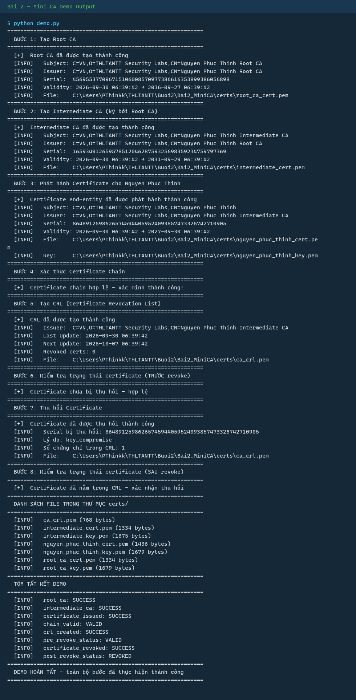
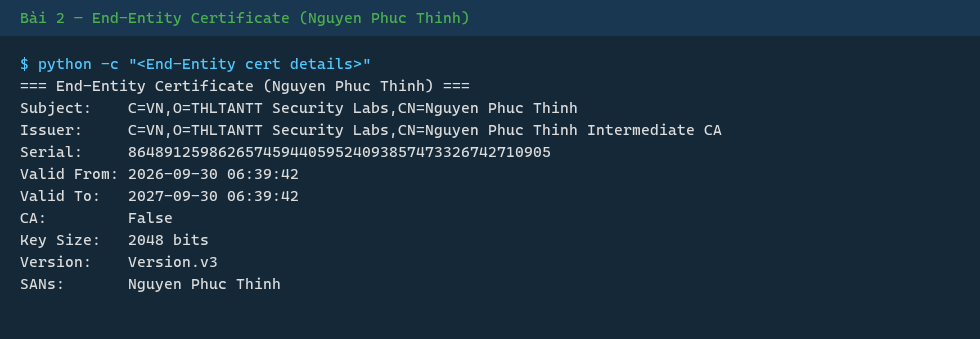
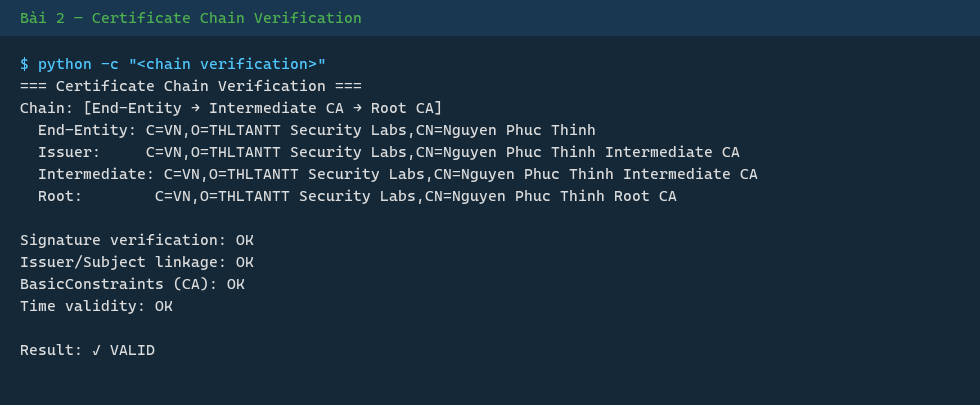
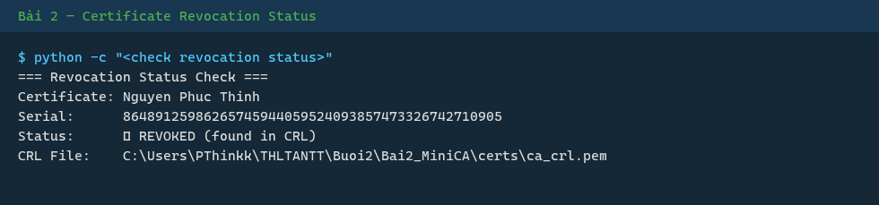

# Bài 2 — Mini CA (Mini Certificate Authority)

> **Sinh viên:** Nguyễn Phúc Thinh — MSSV: 2387700066  
> **Môn:** THLTANTT — Lập trình Bảo mật Thông tin

---

## Mô tả

Mini CA là một hệ thống Certificate Authority (CA) cơ bản được xây dựng bằng Python, sử dụng thư viện `cryptography` để làm việc với chứng chỉ X.509. Hệ thống này mô phỏng một hệ thống PKI (Public Key Infrastructure) thực với các thành phần:

1. **Root CA** — Certificate Authority gốc, tự ký (self-signed), quản lý cấp trung gian.
2. **Intermediate CA** — Certificate Authority trung gian, được ký bởi Root CA, phát hành chứng chỉ cho người dùng/máy chủ.
3. **End-Entity Certificate** — Chứng chỉ cuối cùng cho người dùng "Nguyễn Phúc Thinh".

Hệ thống còn hỗ trợ:
- **Xác thực chuỗi chứng chỉ (certificate chain verification)** — kiểm tra chữ ký số, liên kết issuer/subject, BasicConstraints, và thời hạn.
- **Thu hồi chứng chỉ (CRL)** — thêm chứng chỉ vào Certificate Revocation List.
- **Kiểm tra trạng thái (OCSP simulation)** — kiểm tra serial number trong CRL.
- **Giao diện GUI** — Tkinter để quản lý CA, certificate, và revocation.

---

## Cài đặt

```bash
pip install -r requirements.txt
```

### Dependencies

| Package | Phiên bản | Mục đích |
|---------|-----------|----------|
| cryptography | >=42.0.0 | Tạo/ký/xác thực X.509, CRL |
| pycryptodome | >=3.20.0 | Thư viện mã hóa phụ trợ |
| Flask | >=3.0.0 | Web framework |
| Pillow | >=10.0.0 | Xử lý hình ảnh |

---

## Cấu trúc file

```
Bai2_MiniCA/
├── requirements.txt
├── .gitignore
├── ca_utils.py           — CA core: tạo CA, issue cert, verify chain
├── revoke_utils.py       — CRL: tạo, thu hồi, kiểm tra
├── demo.py               — demo CLI đầy đủ 8 bước
├── demo_ui.py            — GUI Tkinter
├── certs/                — chứng chỉ và khóa (sinh tự động)
│   ├── root_ca_key.pem        ← NOT COMMITTED (private key)
│   ├── root_ca_cert.pem
│   ├── intermediate_key.pem   ← NOT COMMITTED (private key)
│   ├── intermediate_cert.pem
│   ├── nguyen_phuc_thinh_key.pem  ← NOT COMMITTED (private key)
│   ├── nguyen_phuc_thinh_cert.pem
│   └── ca_crl.pem
├── screenshots/
└── gen_bai2_screenshots.py
```

---

## Cấu trúc chứng chỉ (Certificate Hierarchy)

```
                    ┌────────────────────────────────┐
                    │    Root CA (Self-Signed)        │
                    │   CN: Nguyen Phuc Thinh Root   │
                    │   Validity: 10 years            │
                    │   CA=True, path_length=1        │
                    │   Key: RSA 2048-bit             │
                    └───────────────┬────────────────┘
                                    │ (ký bởi Root CA)
                                    ▼
                    ┌────────────────────────────────┐
                    │    Intermediate CA               │
                    │   CN: Nguyen Phuc Thinh Int.    │
                    │   Validity: 5 years             │
                    │   CA=True, path_length=0        │
                    │   Key: RSA 2048-bit             │
                    └───────────────┬────────────────┘
                                    │ (ký bởi Intermediate CA)
                                    ▼
                    ┌────────────────────────────────┐
                    │    End-Entity Certificate         │
                    │   CN: Nguyen Phuc Thinh          │
                    │   O:  THLTANTT Security Labs     │
                    │   C:  VN                         │
                    │   Validity: 1 year               │
                    │   CA=False                       │
                    │   SANs: DNS: Nguyen Phuc Thinh  │
                    │   Key: RSA 2048-bit             │
                    └────────────────────────────────┘
```

**Trust path:** Root CA → Intermediate CA → End-Entity Certificate

---

## Chạy demo

### CLI

```bash
python demo.py
```

Chương trình thực hiện 8 bước:
1. Tạo Root CA
2. Tạo Intermediate CA (ký bởi Root CA)
3. Phát hành certificate cho "Nguyen Phuc Thinh"
4. Xác thực certificate chain
5. Tạo CRL (Certificate Revocation List)
6. Kiểm tra trạng thái certificate (trước khi revoke)
7. Thu hồi certificate
8. Kiểm tra trạng thái certificate (sau khi revoke)

### GUI

```bash
python demo_ui.py
```

---

## API (ca_utils.py)

```python
from ca_utils import (
    create_root_ca,
    create_intermediate_ca,
    issue_certificate,
    verify_certificate_chain,
)

# 1. Tạo Root CA
root_key, root_cert = create_root_ca()

# 2. Tạo Intermediate CA
inter_key, inter_cert = create_intermediate_ca(root_key, root_cert)

# 3. Phát hành certificate
subject_info = {
    "common_name": "Nguyen Phuc Thinh",
    "organization": "THLTANTT Security Labs",
    "country": "VN",
    "email": "2387700066@student.university.edu.vn",
}
end_key, end_cert = issue_certificate(inter_key, inter_cert, subject_info)

# 4. Xác thực chain
chain = [inter_cert, root_cert]  # intermediate → root
is_valid = verify_certificate_chain(end_cert, chain)
```

---

## API (revoke_utils.py)

```python
from revoke_utils import (
    create_empty_crl,
    revoke_certificate,
    check_revocation_status,
)

# Tạo CRL
crl = create_empty_crl(inter_cert, inter_key)

# Thu hồi certificate
crl = revoke_certificate(
    "certs/nguyen_phuc_thinh_cert.pem",
    "certs/intermediate_cert.pem",
    "certs/intermediate_key.pem",
    reason="key_compromise",
)

# Kiểm tra trạng thái
is_revoked = check_revocation_status("certs/nguyen_phuc_thinh_cert.pem")
```

---

## Screenshots

| # | Ảnh minh chứng |
|---|----------------|
| 1 |  |
| 2 |  |
| 3 |  |
| 4 |  |
| 5 |  |
| 6 |  |
| 7 |  |
| 8 |  |
| 9 |  |
| 10 |  |
| 11 |  |

---

## Bảo mật

- **Private keys** (`*_key.pem`) được sinh tự động khi chạy `demo.py` và **không được commit** lên Git — được liệt kê trong `.gitignore`.
- **Public certificates** (`*_cert.pem`) và **CRL** (`ca_crl.pem`) được giữ lại trong repository để minh chứng.
- Thuật toán chữ ký: **SHA-256** (qua `cryptography` library).
- Các extension bảo mật: `BasicConstraints`, `KeyUsage`, `SubjectKeyIdentifier`, `AuthorityKeyIdentifier`, `ExtendedKeyUsage`, `SubjectAlternativeName`.
