# THLTANTT Lab 02 — CryptoToolkit & Mini CA

> **Môn học:** THLTANTT — Lập trình Bảo mật Thông tin (Practical Information Security Programming)  
> **Sinh viên:** Nguyễn Phúc Thinh — MSSV: 2387700066  
> **Giảng viên:** *(theo lớp)*

---

## Mục lục

1. [Giới thiệu](#giới-thiệu)
2. [Cấu trúc thư mục](#cấu-trúc-thư-mục)
3. [Bài 1 — CryptoToolkit](#bài-1--cryptotoolkit)
4. [Bài 2 — Mini CA](#bài-2--mini-ca)
5. [Cài đặt](#cài-đặt)
6. [Chạy thử](#chạy-thử)
7. [Ảnh minh chứng](#ảnh-minh-chứng)

---

## Giới thiệu

Bài thực hành này bao phủ hai chủ đề chính trong mã hóa và an ninh mạng:

- **Bài 1 — CryptoToolkit:** Xây dựng thư viện mã hóa bao gồm mã hóa đối xứng (AES-256-GCM), mã hóa bất đối xứng (RSA-PSS), và băm mật khẩu (Argon2id). Cung cấp giao diện CLI, API (Flask), và GUI (Tkinter).
- **Bài 2 — Mini CA:** Xây dựng hệ thống Certificate Authority (CA) với chuỗi chứng chỉ X.509 — Root CA → Intermediate CA → End-Entity Certificate. Bao gồm xác thực chuỗi chứng chỉ, thu hồi chứng chỉ (CRL), và kiểm tra OCSP.

---

## Cấu trúc thư mục

```
THLTANTT_2387700066_Buoi2/
├── README.md                        ← file này
│
├── Bai1_CryptoToolkit/
│   ├── README.md
│   ├── requirements.txt
│   ├── setup.py
│   ├── securecrypto/
│   │   ├── __init__.py
│   │   ├── aes_utils.py       (AES-256-GCM)
│   │   ├── hash_utils.py      (Argon2id)
│   │   ├── rsa_utils.py       (RSA-PSS)
│   │   ├── cli.py             (CLI interface)
│   │   ├── api.py             (Flask API)
│   │   └── app_gui.py         (Tkinter GUI)
│   ├── tests/
│   │   ├── test_aes_utils.py
│   │   ├── test_hash_utils.py
│   │   └── test_rsa_utils.py
│   ├── files/
│   │   └── data.txt
│   └── gen_bai1_screenshots.py
│
├── Bai2_MiniCA/
│   ├── README.md
│   ├── requirements.txt
│   ├── ca_utils.py
│   ├── revoke_utils.py
│   ├── demo.py
│   ├── demo_ui.py
│   ├── .gitignore
│   ├── certs/               (chứng chỉ và khóa — sinh tự động)
│   └── gen_bai2_screenshots.py
│
└── screenshots/             ← ảnh minh chứng chung (Bài 1 + Bài 2)
    ├── 01_unit_tests.png           (Bài 1)
    ├── 02_aes_encrypt.png           (Bài 1)
    ├── 03_aes_decrypt.png           (Bài 1)
    ├── 04_rsa_genkey.png            (Bài 1)
    ├── 05_rsa_sign.png              (Bài 1)
    ├── 06_rsa_verify.png            (Bài 1)
    ├── 07_argon2_hash.png           (Bài 1)
    ├── 08_flask_api.png             (Bài 1)
    ├── 09_file_listing.png          (Bài 1)
    ├── 10_gui_app.png               (Bài 1)
    ├── 01_demo_output.png           (Bài 2)
    ├── 02_cert_listing.png          (Bài 2)
    ├── 03_root_ca_details.png       (Bài 2)
    ├── 04_intermediate_ca_details.png (Bài 2)
    ├── 05_endentity_cert_details.png  (Bài 2)
    ├── 06_chain_verification.png    (Bài 2)
    ├── 07_crl_contents.png          (Bài 2)
    ├── 08_revocation_status.png     (Bài 2)
    ├── 09_ocsp_status.png           (Bài 2)
    ├── 10_cert_hierarchy.png        (Bài 2)
    └── 11_gui_app.png               (Bài 2)
```

---

## Bài 1 — CryptoToolkit

### Tính năng

| Chức năng | Thuật toán | Thư viện |
|-----------|-----------|----------|
| Mã hóa file | AES-256-GCM | `cryptography` |
| Sinh khóa RSA | RSA 2048-bit | `cryptography` |
| Chữ ký số | RSA-PSS + SHA-256 | `cryptography` |
| Xác thực chữ ký | RSA-PSS + SHA-256 | `cryptography` |
| Băm mật khẩu | Argon2id | `argon2-cffi` |
| CLI | argparse | stdlib |
| Web API | Flask | Flask |
| GUI | Tkinter | stdlib |

### Cài đặt & chạy

```bash
cd Bai1_CryptoToolkit
pip install -r requirements.txt
pytest -v  # 18 tests, tất cả PASS
```

Xem chi tiết trong [Bai1_CryptoToolkit/README.md](Bai1_CryptoToolkit/README.md).

---

## Bài 2 — Mini CA

### Tính năng

| Chức năng | Mô tả |
|-----------|-------|
| Tạo Root CA | Self-signed, BasicConstraints CA=True, path_length=1 |
| Tạo Intermediate CA | Ký bởi Root CA, BasicConstraints CA=True, path_length=0 |
| Phát hành certificate | End-entity cho "Nguyen Phuc Thinh", BasicConstraints CA=False |
| Xác thực chuỗi | Kiểm tra chữ ký, issuer/subject, BasicConstraints, thời hạn |
| Thu hồi chứng chỉ | Thêm vào CRL, ký bởi CA |
| Kiểm tra CRL | Tra cứu serial number trong CRL |
| OCSP simulation | Kiểm tra trạng thái qua CRL |
| GUI | Tkinter — quản lý CA, certificate, revocation |

### Cài đặt & chạy

```bash
cd Bai2_MiniCA
pip install -r requirements.txt
python demo.py        # chạy demo CLI (8 bước)
python demo_ui.py     # mở GUI
```

> **Lưu ý bảo mật:** Các private key (`*_key.pem`) được sinh tự động khi chạy demo và **không được commit** lên Git. Các chứng chỉ công khai (`.pem`) được giữ lại để minh chứng. Xem chi tiết trong [Bai2_MiniCA/README.md](Bai2_MiniCA/README.md).

---

## Cài đặt

```bash
# Cài đặt tất cả dependencies
pip install -r Bai1_CryptoToolkit/requirements.txt
pip install -r Bai2_MiniCA/requirements.txt
```

## Chạy thử

```bash
# Bài 1: chạy unit tests
cd Bai1_CryptoToolkit && pytest -v

# Bài 2: chạy demo Mini CA
cd ../Bai2_MiniCA && python demo.py
```

---

## Ảnh minh chứng

### Bài 1 — CryptoToolkit (10 ảnh)

| # | Ảnh minh chứng |
|---|----------------|
| 1 | 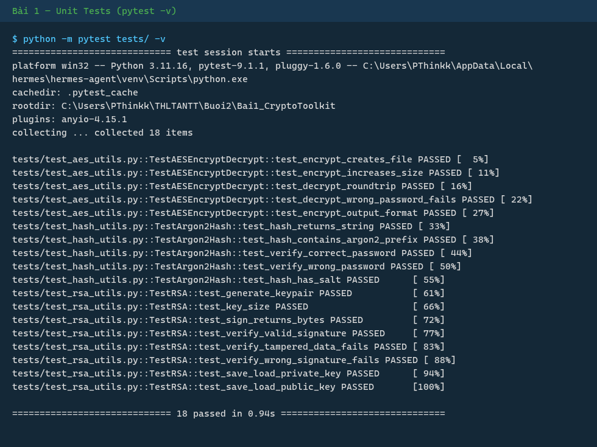 |
| 2 | 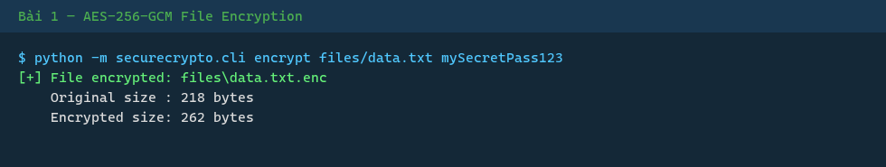 |
| 3 | 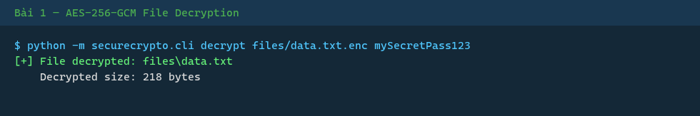 |
| 4 | 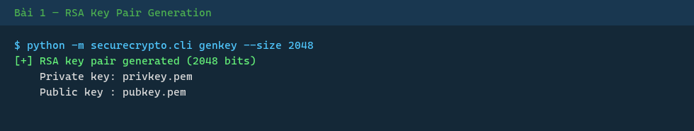 |
| 5 | 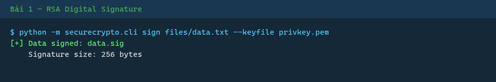 |
| 6 | 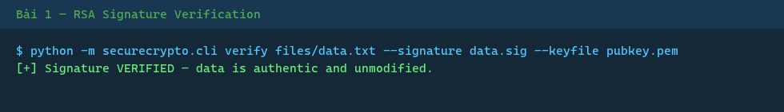 |
| 7 | 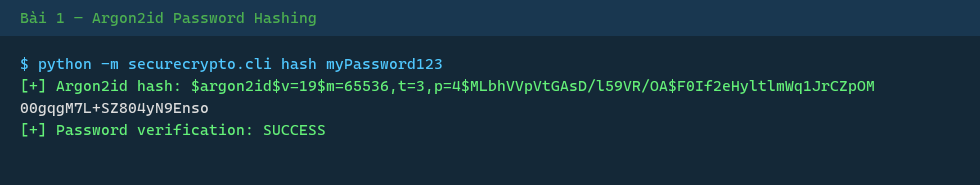 |
| 8 | 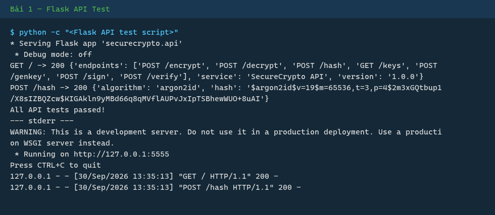 |
| 9 | 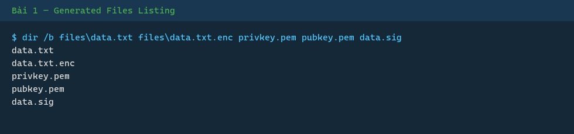 |
| 10 | 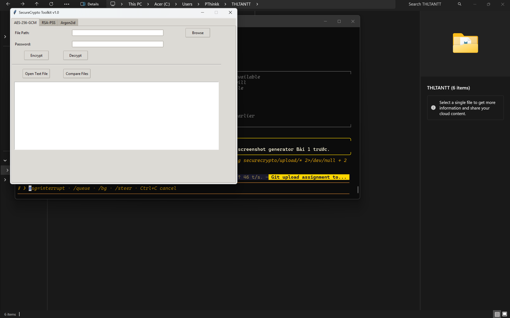 |

### Bài 2 — Mini CA (11 ảnh)

| # | Ảnh minh chứng |
|---|----------------|
| 1 |  |
| 2 | 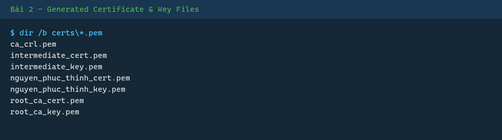 |
| 3 | 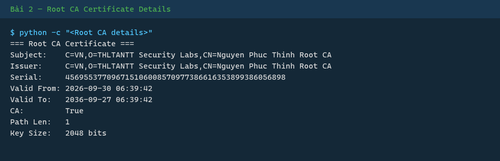 |
| 4 | 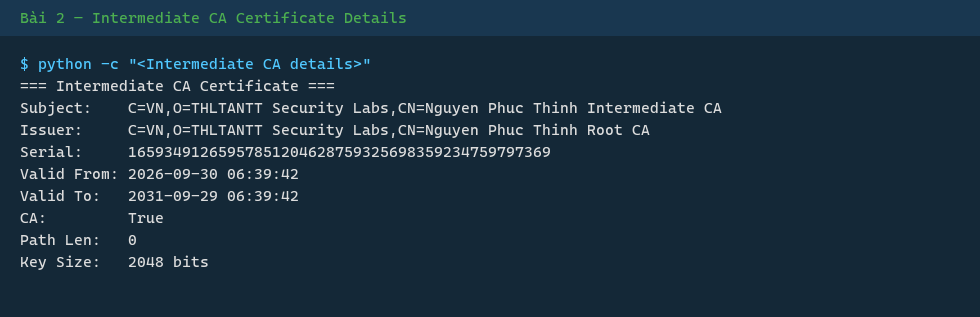 |
| 5 |  |
| 6 |  |
| 7 | 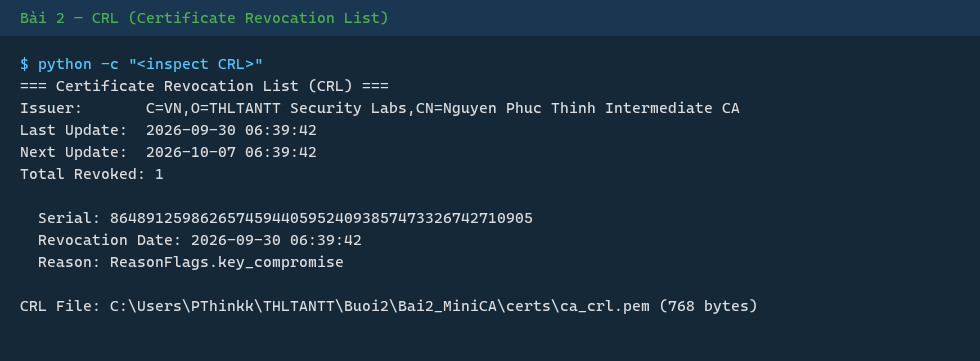 |
| 8 |  |
| 9 | 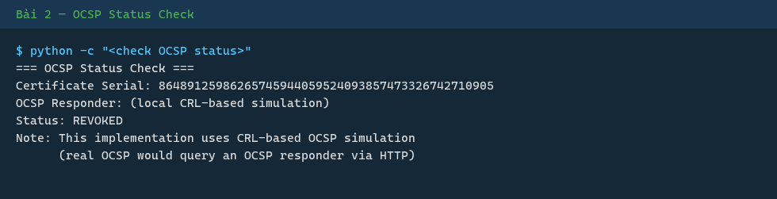 |
| 10 | 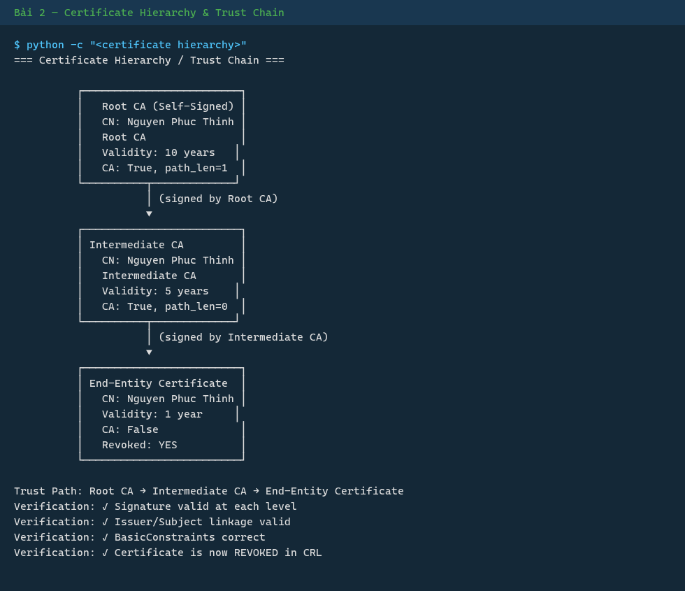 |
| 11 | 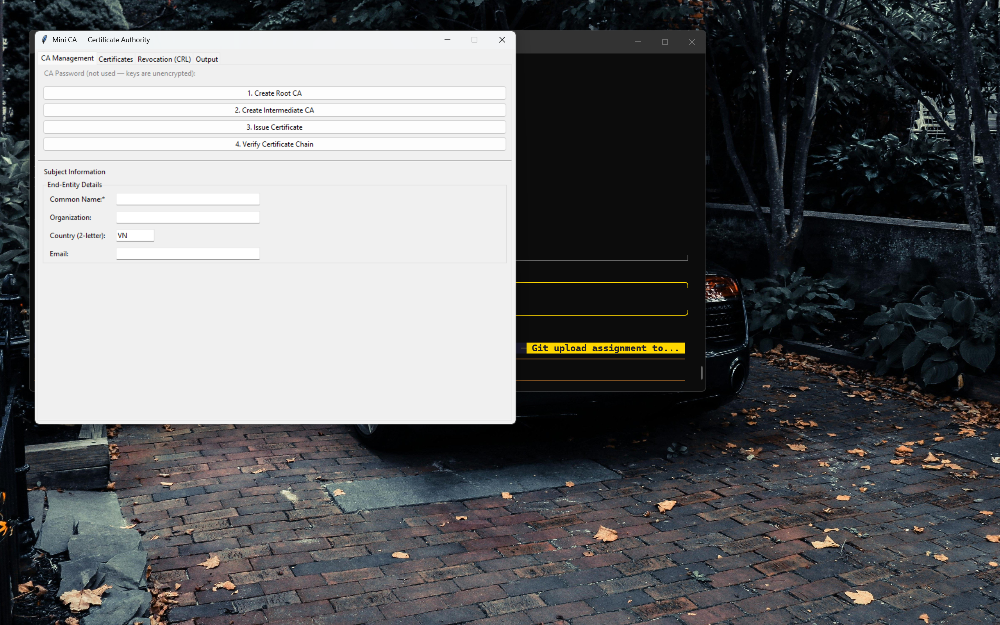 |

---

## Thông tin sinh viên

- **Tên:** Nguyễn Phúc Thinh
- **MSSV:** 2387700066
- **Lớp:** THLTANTT (Lập trình Bảo mật Thông tin Thực hành)
- **Môi trường:** Python 3.11, Windows 11, git-bash/MSYS
