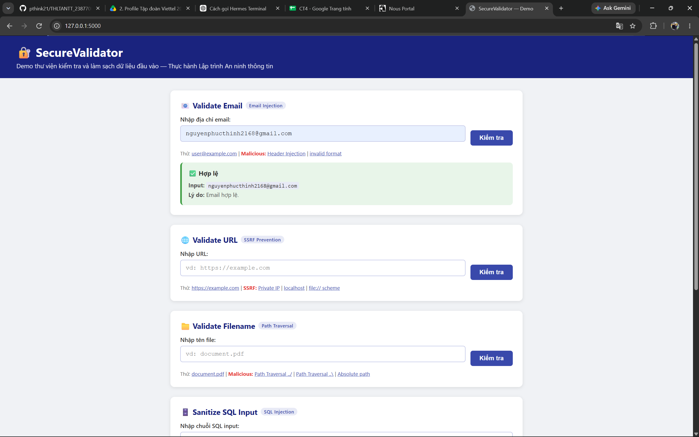
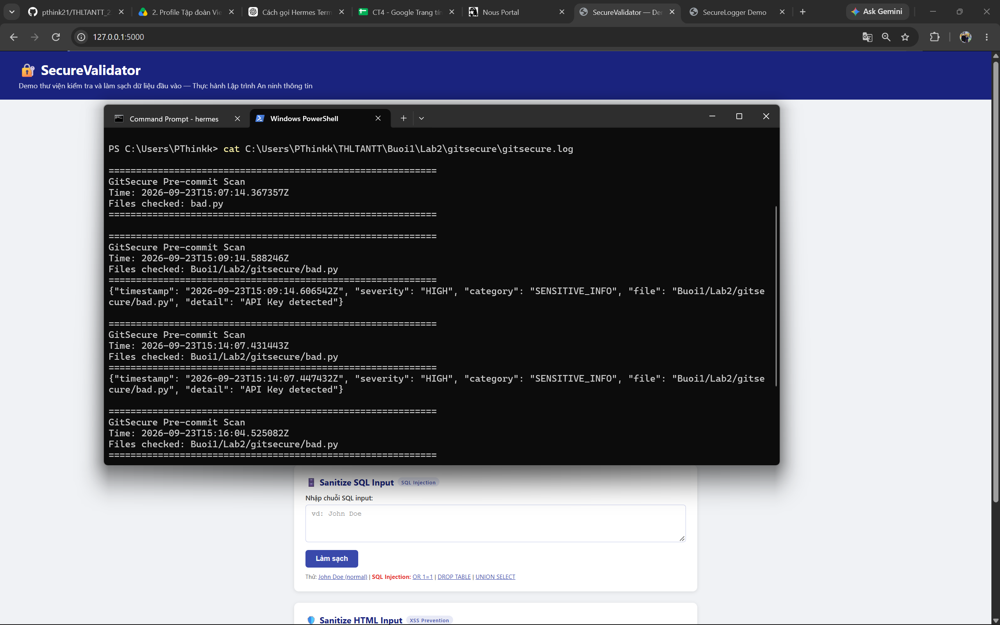
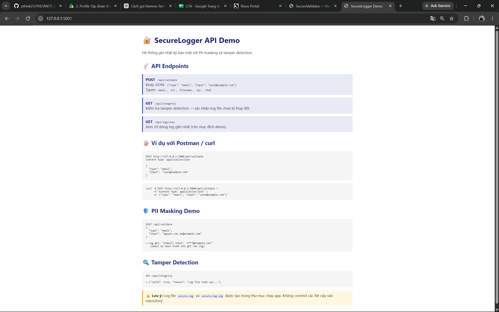

# THLTANTT - NGUYỄN PHÚC THỊNH

## Thực hành Lập trình An ninh thông tin

Repository này chứa các bài thực hành môn **Thực hành Lập trình An ninh thông tin**, tập trung vào các kỹ thuật bảo mật ứng dụng Python.

---

## Buổi 1 — Cơ sở Lập trình Bảo mật, Kiểm tra Đầu vào

### Lab 1 — SecureValidator

Thư viện Python kiểm tra và làm sạch dữ liệu đầu vào, phòng chống:
- Email Injection / Header Injection
- SSRF (Server-Side Request Forgery)
- Path Traversal
- SQL Injection
- XSS (Cross-Site Scripting)

📁 [Buoi1/Lab1](Buoi1/Lab1) | 📖 [README](Buoi1/Lab1/README.md)

**Kết quả chạy:** 50/50 unit test PASS, Flask demo app tại http://127.0.0.1:5000


### Lab 2 — GitSecure

Hệ thống pre-commit hook tự động kiểm tra bảo mật mã nguồn trước khi `git commit`:
- Phát hiện API key, password, token hard-coded
- Phát hiện hard-coded credentials
- Quét bảo mật bằng Bandit
- Kiểm tra file permission
- Kiểm tra license compliance

📁 [Buoi1/Lab2](Buoi1/Lab2) | 📖 [README](Buoi1/Lab2/README.md)

**Kết quả chạy:** Hook phát hiện `API Key hard-coded` → chặn commit (exit code 1)


### Lab 3 — SecureLogger

Hệ thống ghi nhật ký bảo mật với:
- Tự động phát hiện và mask PII (email, CCCD, IP, SĐT)
- Log rotation + gzip compression
- Tamper detection bằng SHA-256
- Structured JSON logging
- Tích hợp với SecureValidator

📁 [Buoi1/Lab3](Buoi1/Lab3) | 📖 [README](Buoi1/Lab3/README.md)

**Kết quả chạy:** Flask API tại http://127.0.0.1:5001, PII masking + tính toàn vẹn log verified


---

## Technologies

| Technology | Mục đích |
|---|---|
| Python 3.10+ | Ngôn ngữ chính |
| Flask | Web framework cho demo UI và API |
| bleach | HTML sanitization (XSS prevention) |
| Bandit | Static security analysis |
| unittest | Unit testing framework |
| Git Hooks | Pre-commit security automation |
| JSON Logging | Structured log format |
| SHA-256 (hashlib) | Tamper detection |
| gzip | Log compression |

---

## Repository Structure

```
THLTANTT/
│
├── Buoi1/
│   ├── Lab1/
│   │   ├── secure-validator-lab/
│   │   │   ├── app.py                  # Flask web demo
│   │   │   ├── requirements.txt
│   │   │   ├── securevalidator/
│   │   │   │   ├── __init__.py
│   │   │   │   └── core.py             # 5 validator functions
│   │   │   ├── templates/
│   │   │   │   └── index.html          # Giao diện web
│   │   │   └── tests/
│   │   │       └── test_validators.py  # 50 unit tests
│   │   └── README.md
│   │
│   ├── Lab2/
│   │   ├── gitsecure/
│   │   │   ├── .githooks/
│   │   │   │   └── pre-commit          # Hook script
│   │   │   ├── requirements.txt
│   │   │   ├── .gitignore
│   │   │   ├── bad.py                  # Demo file có vấn đề
│   │   │   └── README.md
│   │   └── README.md
│   │
│   └── Lab3/
│       ├── secure-logger-lab/
│       │   ├── app.py                  # Flask API demo (port 5001)
│       │   ├── requirements.txt
│       │   ├── securevalidator/        # Copy từ Lab1
│       │   │   ├── __init__.py
│       │   │   └── core.py
│       │   └── securelogger/
│       │       ├── __init__.py
│       │       └── logger.py           # SecureLogger implementation
│       └── README.md
│
├── README.md
└── .gitignore
```

---

## How to Run

### Lab 1 — SecureValidator

```bash
cd Buoi1/Lab1/secure-validator-lab
pip install -r requirements.txt

# Chạy unit tests (50 tests)
python -m unittest discover tests -v

# Chạy Flask demo
python app.py
# → http://127.0.0.1:5000/
```

### Lab 2 — GitSecure Pre-commit Hook

```bash
cd Buoi1/Lab2/gitsecure
pip install -r requirements.txt

# Gắn hook vào git (từ root repository)
git config core.hooksPath Buoi1/Lab2/gitsecure/.githooks

# Cấp quyền (Git Bash / Linux)
chmod +x Buoi1/Lab2/gitsecure/.githooks/pre-commit

# Test bằng cách thử commit file có vấn đề
git add Buoi1/Lab2/gitsecure/bad.py
git commit -m "test"  # → Sẽ bị chặn!
```

### Lab 3 — SecureLogger

```bash
cd Buoi1/Lab3/secure-logger-lab
pip install -r requirements.txt

# Chạy Flask API
python app.py
# → http://127.0.0.1:5001/

# Test API
curl -X POST http://127.0.0.1:5001/api/validate \
     -H "Content-Type: application/json" \
     -d '{"type": "email", "input": "user@example.com"}'

# Kiểm tra tamper detection
curl http://127.0.0.1:5001/api/integrity
```

---

## Security Principles Applied

1. ✅ **Secure by Design** — Bảo mật tích hợp từ thiết kế
2. ✅ **Input Validation** — Validate trước khi xử lý
3. ✅ **Sanitization** — Làm sạch theo context
4. ✅ **Whitelist Approach** — Ưu tiên allow-list
5. ✅ **Defense in Depth** — Nhiều lớp bảo vệ
6. ✅ **Least Privilege** — Quyền tối thiểu
7. ✅ **No Secret in Code** — Không hard-code credential
8. ✅ **Secure Logging** — Không log PII thô
9. ✅ **Tamper Detection** — Phát hiện thay đổi log
10. ✅ **SSRF Protection** — Chặn request đến IP nội bộ
